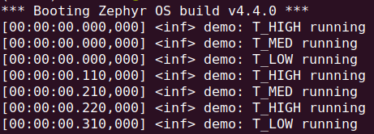
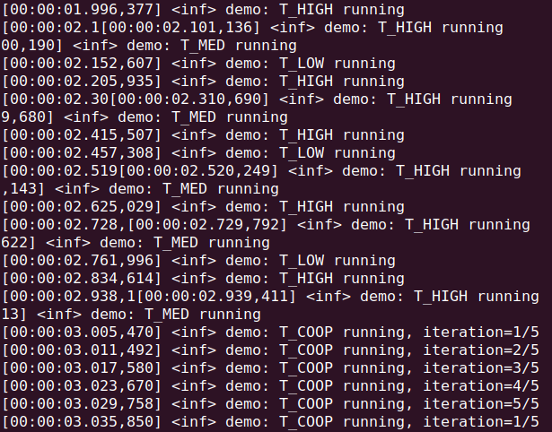

# L1 Task 1 — Ready vs Waiting, k_yield vs k_sleep

Four threads in `app/src/main.c`:

- `t_low` (prio 7), `t_med` (5), `t_high` (3) — preemptive, log then sleep
- `t_coop` (prio -1) — cooperative, 5 iterations of busy work then `k_yield()`,
  starts 3s late so the preemptive baseline is visible first

## Observations

- Run frequency follows sleep duration, not priority: `T_HIGH` logs ~3x as often
  as `T_LOW` only because it sleeps 1/3 as long.
- Priority only breaks ties. The sole tie is at boot, where the threads log in
  strict priority order. After that each wakeup lands on its own tick against an
  empty ready queue.
- Measured periods are 110/210/310ms, not 100/200/300ms, because `k_msleep()` is a
  minimum and rounds up to the next tick.
- Once `t_coop` starts it starves all three permanently. `k_yield()` only rotates
  against threads of equal or higher priority, and `t_coop` is alone at -1, so it
  is immediately reselected. The others reach Ready when their timers fire but
  never run.
- `k_msleep()` would move `t_coop` to Waiting and let them proceed. That is the
  Ready vs Waiting distinction.
- Log lines split into each other in immediate mode: `LOG_INF()` writes to the
  UART synchronously and non-atomically, so a higher-priority thread can preempt
  mid-message. Visible proof of preemption, but it makes the capture messy.

### Task 1 - part 1

### Task 1 - part 2

