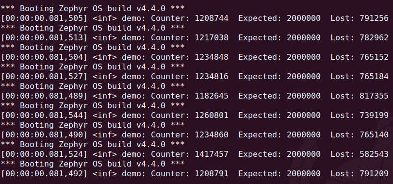
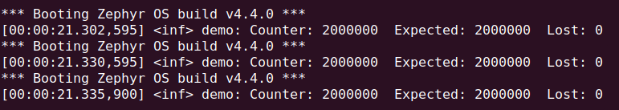

# L2 Task 1 — Observe and fix a race condition

Two threads in `app/src/main.c`:

- `thread_a` and `thread_b` — same entry function, both preemptive at priority 5,
  each incrementing a shared `volatile uint32_t counter` 1,000,000 times
- `main` (priority 0) joins both, then reports counter vs the expected 2,000,000

`CONFIG_TIMESLICE_SIZE=1` shortens the default 20ms slice so equal-priority
threads swap 20x more often, giving the race far more chances to happen.

## Results

| Version | Runtime | Counter (expected 2000000) |
|---------|---------|----------------------------|
| No lock | 81.5 ms | 1182645 – 1417457, different every run |
| Mutex   | 21.3 s  | 2000000, every run |

## Observations

- `counter++` is not atomic. It compiles to LDR / ADD / STR, and a context switch
  between the load and the store makes the thread write back a stale value.
- The counter can only lose, never gain. Every store writes some previously read
  value plus one, so the total is capped at 2,000,000. Two increments collapsing
  into one is a lost update.
- ~40% of all increments were lost. A timer interrupt has roughly a 40% chance of
  landing inside the LDR..STR window, which is about 2 of the ~5 instructions in
  the loop body.
- `K_MUTEX_DEFINE` plus `k_mutex_lock`/`k_mutex_unlock` around the read-modify-write
  fixes it exactly. A mutex has an owner, so only the locking thread may unlock it,
  and it applies priority inheritance to avoid priority inversion.
- The fix is correct but slower. At ~10.6us per increment the cost is far more
  than a lock/unlock pair: both threads contend for the same lock constantly, so
  many locks block and force a scheduler round trip. The synchronization costs far
  more than the work it protects.
- `atomic_inc()` on an `atomic_t` would be the right tool for a bare counter. It is
  a single LDREX/STREX retry loop with no kernel involvement, so it runs near the
  unprotected speed and is still exactly correct. A mutex earns its cost when the
  critical section is large, not when it guards one increment.
- A mutex cannot be used in an ISR, since an ISR cannot block. Data shared with an
  interrupt handler needs `k_spinlock` or `irq_lock` instead.

### Task 1 - part 1

### Task 1 -part 2

